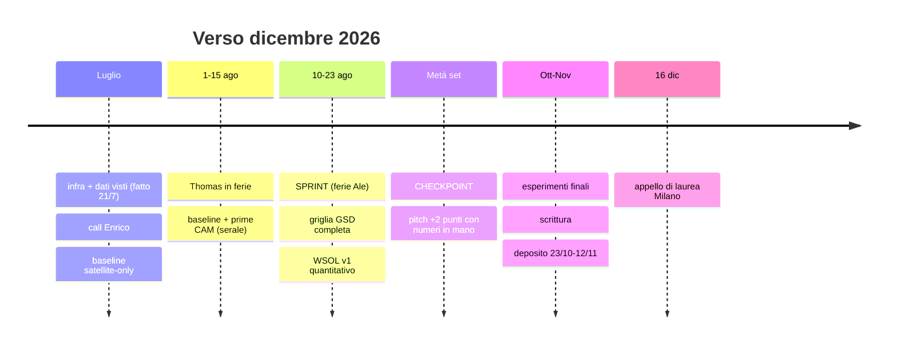

# STATO — snapshot corrente della tesi

> **Memoria di lavoro della repo.** Chi (umano o agente) inizia una sessione parte da qui; chi la chiude aggiorna questo file: sostituisci il contenuto superato (non appendere), aggiorna la data, tieni compatto. La cronologia fine sta in `docs/01_calls/` e nel git log. Se questo file contraddice l'ultima call in `docs/01_calls/`, **vince la call** — e va corretto qui.
>
> **Ultimo aggiornamento: 2026-07-21 (sera).**

## 📌 Stato in breve

Pivot del 17/7: da material classification MS a **binary landfill detection satellite-only**, asse sperimentale = **risoluzione** (30 cm → ~70 cm → 1.2 m). Obiettivo dichiarato di Ale: **≥7 punti a dicembre** → piano in `docs/04_planning/2026-07-19_piano_7_punti.md` (North Star: *weakly-supervised waste localization under GSD degradation*). Fase attuale: **infra fatta, dati visti** (21/7) → call con Enrico (proposta: giovedì 23/7) → primo sanity-training entro dom 26/7.

## 🗺️ La rotta (concordata con Thomas, non perderla di vista)

1. **Luglio**: comprimere la base — infra ✅, dati ✅, call Enrico, replica baseline satellite-only, griglia risoluzioni v1.
2. **1–15/8**: Thomas in ferie; lavoro serale/weekend su baseline + prime CAM.
3. **10–23/8 (ferie Ale = full-time)**: LO SPRINT che vale il piano — griglia completa, WSOL v1 con valutazione quantitativa, indice + introduction draft.
4. **~metà settembre**: CHECKPOINT — pitch dei +2 punti a Thomas **con numeri in mano**; decisione col prof. Base da ~5 punti = floor garantito, +2 solo con innovazione riconoscibile.
5. **Fine settembre**: fine contratto visiting → più tempo; freeze scope.
6. **Ottobre–novembre**: esperimenti finali + scrittura (versione lunga → condensata in article ~30 pp + executive summary ~6 pp; serve consenso scritto del relatore per il formato). Deposito UniTesi 23/10–12/11, approvazione relatore entro 19/11.
7. **16/12**: appello di laurea Milano. Fallback: aprile 2027.

Regola: scrittura in parallelo agli esperimenti, mai alla fine; ogni esperimento → `EXPERIMENTS_LOG.md` + `CLAIMS.md`.

## 👥 Persone

| Chi | Ruolo |
|---|---|
| Prof. Piero Fraternali | Relatore (decide formato/impostazione; chiede sempre l'**indice**) |
| Thomas Martinoli | Supervisore operativo, revisor primario |
| **Enrico Targhini** (enrico.targhini@polimi.it) | Ricercatore, guida AI/codice waste (da 17/7); assegna repo GitLab |
| Federico Gibellini ("Fede") | Autore baseline binary (paper 2025) |
| Alari | Tesista 2024, material classification satellite (politesi 10589/230633, 11.477 annotazioni multi-label image-level) |
| Ale (Alessandro Potenza) | Tesista; remoto da Roma; contratto visiting fino a fine settembre |

## 🔑 Fatti chiave correnti

- **Task**: binary detection su dataset satellite-only **~1.200 img → ~2.000 con WorldView** (vs ~10k AerialWaste). Annotazioni image-level; **non esistono maschere di segmentazione** per i dataset del gruppo (deck v7) → test-set di localizzazione da costruire (gating del piano).
- **Baseline riferimento**: Gibellini 2025 — Swin-T+RSP, 20 cm, context 100 m, **F1 92.02**; factorial 36 config (GSD 20/30/50); generalizzazione cross-country F1 86.92; la pipeline **include già Grad-CAM→GIS**. Replica personale in `waste/`: F1 0.9519 su AerialWaste v3.
- **Novelty bar** (per i +2 punti) — **verdetto mini-SOTA 21/7: novel con condizioni** (`docs/02_research/wsol_mini_sota.md`). Nessuno studio trovato che valuti quantitativamente la localizzazione weakly-supervised sotto degradazione controllata di GSD. Ma Mazzola 2024 è più avanti del previsto (IoU quantitativa e confronto 0.3-vs-1.2m già fatti, senza protocollo WSOL standard) e il gruppo ha una survey WSOD-RS propria (Fasana 2022). Delta obbligatori: protocollo WSOL standard (MaxBoxAcc/pointing game) + degradazione GSD controllata multi-punto + task waste + metodo oltre vanilla CAM.
- **Risoluzioni**: 30 cm pansharpened (start) → ~70 cm → 1.2 m nativo (a 1.2 m i FM diventano usabili). Razionale: IRIDE (best 1 m) + costi ARPA. PlanetScope 3 m: fuori.
- **FM in-house** del gruppo in preparazione → pesi ad hoc in arrivo (tempi ignoti).
- **Punteggio**: journal thesis ≤8 punti a contenuto; impostazione attuale ≈5; +2 solo con innovazione. Media Ale 28.7 → base ~105.
- **Formato tesi**: article/journal **≈30 pagine** + **Executive Summary ~6 pp** (errata di Thomas — in call si era detto ~10). Serve consenso scritto del relatore per il formato article. Template su pagina IngIndInf "Modelli formato tesi" (anche Overleaf). Strategia: scrivere lunga → condensare. Esempi: Alari (lunga), Merlo 10589/252150, Mazzola 10589/230433.
- **Infra**: server **eagle**, container **multispectralwaste**, porta **2212** — guida completa in `docs/00_context/server_eagle_howto.md`. Codice tesi del gruppo su **GitLab** (non GitHub), assegnato da Enrico. **Accesso operativo dal 21/7** da entrambi i PC. GPU: 2× RTX PRO 6000 Blackwell **~98 GB** VRAM, libere al primo accesso.
- **Path chiave su eagle** (ricognizione 21/7, da approfondire con Enrico): dataset in `/data/waste/datasets/` — **`SatRaw/`** (PNEO + `ssl/`, ~2k file: probabile satellite-only), **`AerialWaste3.6/`** (con `splits/`, `patches/`, `prod/` — versione interna post-3.0), `asbestos_with_context/`; multilabel in `/data/waste/multilabel/` — `alari/` (code+data), `fede_faspas_replic/`, **`SSL_pretrained_models/exported_last_{100,500}_ep.pt`** (probabili pesi SSL in-house già esportati); imagery in `/archive/satellite/{raw,processed}/` — decine di strip WV3/PNEO/SkySat Lombardia, naming `SENSORE_AREA_DATA_BANDE_GSD_bit_FONTE` (es. `WV3_ENDINE_20250619_VNIR_30cm_16bit_MAXAR`, `PNEO_LOMBARDIA_2023_ALL_30cm_16bit_THOMAS`); `/data/waste/` ha anche `satellite-pipeline/` (GIS, inference, poc), `change_detection/`, `risk/`.
- **Timeline**: sprint ferie **10–23/8**; checkpoint +2 con Thomas **~metà settembre**; contratto Ale finisce fine settembre; scrittura ott–nov. **Sessione dicembre 2026** [HIGH — verificato 19/7 su scadenzario da loggato + PDF calendario a.a. 2026/27, forniti da Ale]: iscrizione appello + deposito tesi UniTesi **23/10 (00:00) → 12/11 (23:59)**; verbalizzazione esami entro 12/11; approvazione tesi del relatore entro **19/11**; **appello di laurea Milano mer 16/12** (il 15/12 è poli territoriali). Fallback: sessione aprile 2027 (Milano gio 8/4). → tesi chiusa entro ~10/11, review Thomas/prof entro fine ottobre. Thomas via 1–15/8.

## ✅ TODO aperti

1. **Ale — subito**: (a) msg a Thomas: server ok + proporre **call giovedì 23/7** (mercoledì Ale non c'è); (b) studiare i 2 doc pronti (~25 min totali): `docs/02_research/2026-07-21_eda_dati_eagle.md` + `baseline_gibellini_frozen.md`.
2. **Call Enrico/Thomas (giovedì)**: domande aggiornate post-EDA in fondo a `2026-07-21_eda_dati_eagle.md` (bbox affidabili? split Thomas ufficiali? livello 0.7m? natura dei pesi SSL RGB? bande usate? WorldView in arrivo? negative sampling?). Le vecchie domande del piano restano come sfondo.
3. **Claude**: (1) ~~doc-baseline Gibellini~~ ✅ 21/7; (2) ~~mini-SOTA WSOL~~ ✅ 21/7 (verdetto sopra); (3) ~~indice tesi v0~~ ✅ 21/7 (`docs/04_planning/indice_tesi_v0.md`); (4) ~~related work detection~~ ✅ 22/7 (`docs/02_research/related_work_detection_draft.md`, cap.2 in inglese ~5pp); (5) tenere vivi `EXPERIMENTS_LOG.md` + `CLAIMS.md`. Preparata anche la scaletta call (`docs/04_planning/call_enrico_brief.md`).
4. ~~Sanity + baseline~~ ✅ EXP-001 (21/7) e **EXP-002 (22/7)** completati — Swin-T+RSP protocollo Gibellini, bande e normalizzazione ufficiali (scoperte in `/scratch`: README Thomas + config), copertura 100%: **val F1 0.796 @0.3m / 0.729 @1.2m; test (comuni nuovi) 0.683 / 0.691 — quasi pari**. Caveat input-size 224px da discutere in call. Dettagli: `EXPERIMENTS_LOG.md`.
5. Overleaf: aprire i template ufficiali IngIndInf — [Article Format](https://www.overleaf.com/latex/templates/article-format-thesis-scuola-di-ingegneria-industriale-e-dellinformazione-politecnico-di-milano/vtqgsrqwzdmy), [Executive Summary](https://www.overleaf.com/latex/templates/executive-summary-scuola-di-ingegneria-industriale-e-dellinformazione-politecnico-di-milano/yfvqyfyyhwrp), [Classical](https://www.overleaf.com/latex/templates/classical-format-thesis-scuola-di-ingegneria-industriale-e-dellinformazione-politecnico-di-milano/dkmvtndqkyxg) — clonare article+exec summary; ricordare **consenso scritto del relatore** per il formato article.
6. In attesa: short "Asha" change detection (Thomas, se esiste); rapporto pesi SSL ↔ "FM in-house"; tempi campagna annotazione.

## 🧊 Filone materiali (in pausa, non morto)

RQ pre-pivot: MS vs RGB per material classification (hazard/risk framing Fazzo 2020). Tutto il materiale resta valido come base: related work draft + bib verificata (`docs/02_research/loop_prof_sota/`), firme spettrali (`spectral/`), pilot amianto (`asbestos/`). L'angolo B del piano (risoluzione×spettro) lo ricicla dentro la nuova task.

## 📜 Log decisioni

- **2026-07-21 (sera)**: infra chiusa (VPN gestita con `vpn_eagle.sh`, cookie ~30gg, unità systemd; ssh da Jimmy e Jhonny; venv+GPU ok). EDA server: split 0.3m/1.2m già pronti (`SatRaw/PNEO/Thomas`), 2.827 bbox su 286 positive satellite-only → gating question in gran parte risolta; pesi SSL in-house = ResNet-50 RGB. Doc-baseline Gibellini congelato (+fix DOI e delta RSP 1.62 pp negli appunti). Repo riordinata (node_modules e worktree v7 rimossi, branch mergiati cancellati, README con sezione workspace remoto).
- **2026-07-19**: obiettivo ≥7 dichiarato; piano operativo (`docs/04_planning/2026-07-19_piano_7_punti.md`); infra ricevuta (eagle/2212/multispectralwaste); errata formato (article ≈30 pp + exec summary); novelty alert Mazzola; repo riorganizzata per handoff agente (STATO.md, `.claude/commands/`, 04_planning). Sera: msg a Enrico inviato; root repo ripulita (build legacy → `assets/_legacy_builds/`, temp eliminati, `datasets_study_guide.pdf` → `docs/02_research/`).
- **2026-07-17 (pomeriggio)**: punteggio ≈5 vs 8; strategia base-poi-upgrade (`docs/01_calls/2026-07-17_punteggio_strategia.md`).
- **2026-07-17 (mattina)**: **pivot a binary detection satellite-only** (`docs/01_calls/2026-07-17_pivot_binary_detection.md`).
- **2026-06-30**: revisione deck direzione WV-3+Pléiades Neo. **2026-06-28**: loop SOTA materiali completo (`docs/02_research/loop_prof_sota/00_LOOP_LOG.md`).
- Storia precedente: `docs/01_calls/` (2026-04-24 pivot SuperDove, 2026-05-22/26 slide, ecc.).
