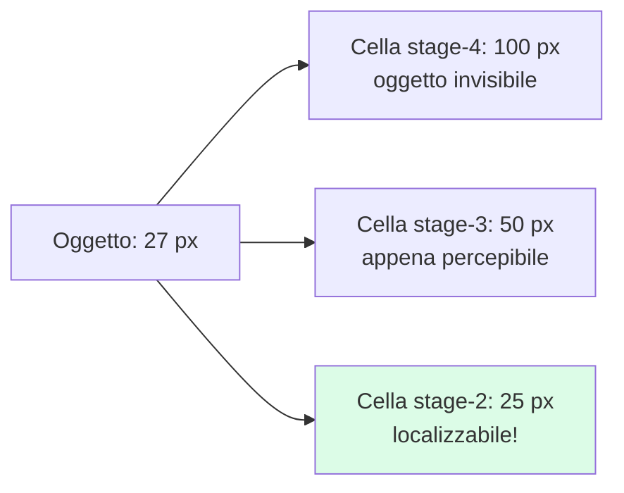
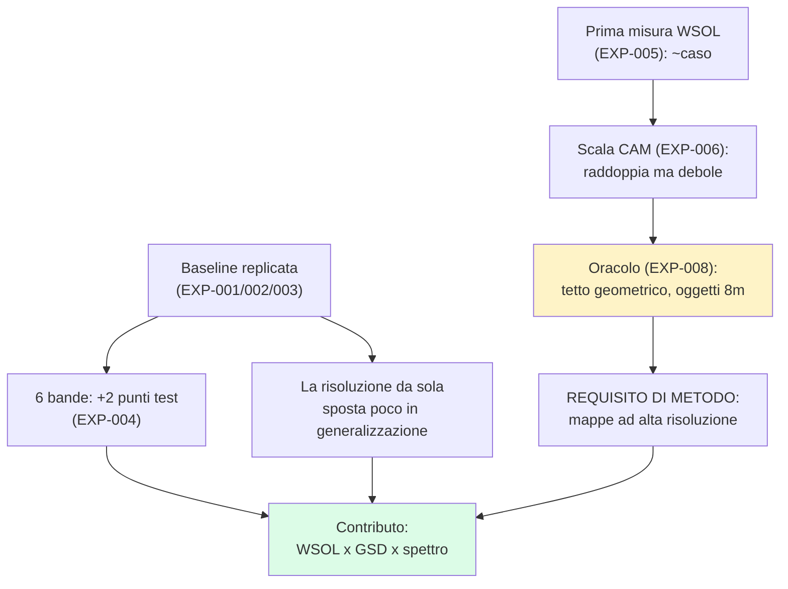

# 📖 Guida di studio — capire tutto, dalle basi

> Documento vivo, mantenuto da Claude: ogni volta che facciamo qualcosa di nuovo, qui compare
> la spiegazione. Ultimo aggiornamento: **2026-07-23 sera** (fino a EXP-008).
>
> Come usarla: 🚶 percorso completo = leggi in ordine (~90 min la prima volta).
> 🏃 ripasso veloce = solo i riquadri "In una frase" e la sezione 5.
> Il changelog in fondo dice cosa è cambiato dall'ultima volta.

## 1. Le fondamenta — immagini satellitari

**GSD (ground sampling distance)** — quanto terreno copre un pixel. GSD 0.3 m = un pixel è
un quadrato di 30 cm; un'auto (~4.5 m) è ~15 pixel. A GSD 1.2 m la stessa auto è ~4 pixel.

**Bande spettrali** — il satellite non vede solo rosso/verde/blu. Pléiades Neo ne registra 6:
DeepBlue, Blue, Green, Red, RedEdge, NIR (vicino infrarosso). RedEdge e NIR sono invisibili
all'occhio ma utilissime: la vegetazione riflette fortissimo nel NIR, molti materiali artificiali no.
I valori sono **riflettanza ×10.000** (quanta luce la superficie riflette), non "colori".

**Pansharpening** — il satellite acquisisce una banda pancromatica (b/n) ad alta risoluzione (0.3 m)
e le bande colore a bassa (1.2 m). Il pansharpening le fonde: ottieni le 6 bande "a 0.3 m".
Trucco utile ma introduce artefatti — per questo "0.3 pansharpened vs 1.2 nativo" non è un
confronto di sola risoluzione (il confound che rimproveriamo al confronto di Mazzola).

**Tile** — le immagini enormi (strip) vengono tagliate in quadrati (~200 m di lato) su cui
lavora il modello. Le nostre tile vengono ritagliate al volo dai mosaici delle strip.

**Simulare un GSD più grosso (il 60 cm)** — il livello 60 cm non esiste come acquisizione:
lo deriviamo noi dal 30 cm facendo la **media di ogni blocco 2×2 di pixel** → un pixel da 60 cm
(700×700 px diventano 350×350, stesse 6 bande, stessa area a terra). È quello che Thomas ha
chiesto ("aggregando i pixel, media o massimo"). Nota fine: in letteratura il modo "rigoroso" di
simulare un sensore più grosso è sfocare prima con un filtro gaussiano che imita l'ottica del
sensore (protocollo di Wald, usato nella valutazione del pansharpening) e poi decimare; la media
2×2 ne è la versione semplice. Se te lo chiedono: "aggreghiamo 2×2 con la media, come da
protocollo del gruppo; l'alternativa MTF/Wald la conosciamo ed è un check possibile".
Script: `eagle/derive_60cm.py` (testato: bounds identici, valori esatti).


## 2. Le fondamenta — il task e le metriche

**Il task**: binary classification per tile — "c'è una discarica abusiva? sì/no".
Il modello risponde con uno score 0-1; sopra soglia (0.5) = positivo.

**Precision / Recall / F1** — Precision: dei positivi predetti, quanti veri? Recall: dei veri,
quanti trovati? **F1 = media armonica** delle due: alta solo se entrambe alte. È LA metrica
del campo (Gibellini: F1 92.02 su aereo).

**Val vs test, e perché il nostro test è "cattivo"** — il modello si sceglie sulla validation
e si giudica sul test. Nei nostri split il test è fatto di **comuni mai visti in training**
(split geografico): misura la generalizzazione, che è quello che interessa ad ARPA. Per questo
i numeri di test sono più bassi della val: non è un errore, è la domanda giusta.

**Perché più seed** — il training ha casualità (ordine dei dati, inizializzazione della testa).
Un numero da solo può essere fortuna: 3 run con seed diversi → media ± deviazione. Se due
metodi differiscono meno della deviazione, non puoi dire chi vince.

## 3. Le fondamenta — il modello e il training

**Dalla CNN allo Swin** — le CNN (ResNet) scorrono filtri locali sull'immagine. I transformer
dividono l'immagine in patch e le fanno "parlare" tra loro (attention). **Swin-T** (~27M parametri)
è un transformer gerarchico: 4 stage a risoluzione decrescente — dentro: 56×56 → 28×28 → 14×14 → 7×7
celle. Ricordati questi numeri: sono il cuore di EXP-008.

**Transfer learning e RSP** — non si parte mai da zero: si prende una rete già allenata su
milioni di immagini e la si adatta. ImageNet = foto generiche; **RSP** = pretraining su
Million-AID, immagini aeree → più adatto al nostro dominio (Gibellini: +1.6 F1).

**Il protocollo two-step (Gibellini)** — fase 1 "TL": backbone congelato, si allena solo la
testa (10 epoche, LR 1e-3). Fase 2 "FT": si sblocca l'ultimo stage (20 epoche, LR 1e-4, cosine).
Idea: prima insegni alla testa a leggere le feature, poi raffini le feature senza distruggerle.

**Weight inflation (per le 6 bande)** — i pesi pretrained si aspettano 3 canali RGB. Per darne 6:
i kernel RGB vanno nelle posizioni giuste dell'ordine bande, le bande nuove ricevono la media
dei kernel, e tutto si riscala per mantenere l'ordine di grandezza. Così il pretraining non si butta.

## 4. Le fondamenta — localizzare senza etichette: WSOL e CAM

**Il problema** — le etichette dicono solo "in questa tile c'è waste", non DOVE. La
localizzazione weakly-supervised (WSOL) tira fuori il "dove" gratis, dal classificatore stesso.

**CAM (class activation map)** — l'ultimo stage della rete è una griglia di celle (7×7) con
feature. La CAM pesa le feature con i pesi della testa: ottieni una mappa di calore "dove il
modello guarda". **Grad-CAM** generalizza usando i gradienti. La mappa è alla risoluzione
dello stage: 7×7 dallo stage 4, 14×14 dallo stage 3...

**Le metriche WSOL** (protocollo Choe 2020) — **pointing game**: il pixel più caldo della
mappa cade dentro una box vera? **MaxBoxAcc**: dalla mappa sogliata si estrae una box; conta
la frazione di immagini con IoU ≥ 0.5, al meglio sulla soglia. **IoU** = area intersezione /
area unione tra due box (1 = perfetto).

**Perché qui è difficile (il risultato chiave di questa settimana)** — i nostri oggetti
annotati hanno lato mediano **8 metri = 27 px a 0.3m**. Una cella della griglia 7×7 copre
100 px: il 99% degli oggetti sta DENTRO una cella. Una mappa 7×7 non può localizzarli
**nemmeno se fosse perfetta** (l'oracolo di EXP-008 lo dimostra: tetto = il nostro numero reale).



## 5. La storia dei nostri esperimenti (il racconto guidato)

Ogni riga: cosa ci chiedevamo → cosa è uscito → cosa ne abbiamo imparato.
Dettagli completi con figure: `docs/04_planning/EXPERIMENTS_LOG.md`.

| EXP | Domanda | Risultato | Lezione |
|---|---|---|---|
| 001 | La pipeline dati funziona? | val F1 0.73/0.69 (ResNet, 5 epoche) | Sì; primo indizio effetto risoluzione |
| 002 | Baseline seria (Swin+RSP, protocollo Gibellini)? | val 0.796 @0.3m; test 0.68-0.69 | Trovati bande e normalizzazione ufficiali strada facendo; test su comuni nuovi molto più duro |
| 003 | Regge coi seed? | test: 0.692±0.011 vs 0.680±0.010 | In-domain la risoluzione vale ~5 punti; in generalizzazione ~1 (rumore) |
| 004 | 6 bande servono? | test @0.3m: **0.711** vs 0.692 RGB | Primo indizio: il multispettrale aiuta la **generalizzazione** |
| 005 | La Grad-CAM localizza? | PG 6-12% ≈ caso (2%) | Vanilla CAM ≈ inutile qui; verificato che non è un bug |
| 006 | E le CAM migliori? | stage-3 raddoppia (IoU max 0.143), resta debole | Cambiare CAM non basta |
| 008 | PERCHÉ non basta? | oggetti 8 m; oracolo 7×7 = 0.06 = nostro reale | **Tetto geometrico**: serve un metodo con mappe ≥28×28 |
| 007 | Il vincolo cross-risoluzione aiuta? | detection: neutro; **localizzazione a 1.2m: pg 0.10→0.15**, 3/3 seed | Il metodo aiuta dove deve (alla risoluzione degradata) |
| 009 | Mappe più fitte sfondano il tetto? | input 448/672: **pg 0.12→0.36/0.38** | Previsione dell'oracolo confermata; costo: detection ↓ → serve retrain a 448 |
| 010 | Retrain a 448: si tiene tutto insieme? | **pg 0.42 con F1 0.70**; a 1.2m pg si dimezza (0.18) ma F1 tiene | ×7 in una settimana; **la risoluzione colpisce il "dove", non il "se"** — il risultato di tesi |
| 011 | La pipeline di Enrico gira? Che baseline dà? | `b120_rgb_resnet50_rsp_aug1_s0`: test F1 0.635 @0.5 (0.645 best-th) | Pipeline validata end-to-end (4 fix sulla branch `ale`); la loro resnet50-RGB sta sotto la nostra Swin equivalente → il porting del nostro stack ha senso |
| 012 | SwinT vs ResNet50, stessa pipeline? | `b120_rgb_swint_rsp_aug1_s0`: test F1 **0.706** (+7.1 pp) | La scelta SwinT+RSP regge anche su dati 8-bit nella pipeline ufficiale |
| 013 | Le 6 bande aiutano anche qui? | `b120_vnir_swint_rsp_aug1_s0`: F1 0.667 (−4 pp vs RGB) | A 120 cm il MS non guadagna — coerente con EXP-004 (anche da noi a 1.2m era piatto; il +1.9 c'era solo a 0.3m) |
| 014 | Regge su 3 seed? | RGB 0.694±0.019 vs 6-bande 0.665±0.006 (RGB sopra 3/3) | **A 120 cm lo spettro non compensa la risoluzione persa** — prima evidenza vera per C-4, replicata su due pipeline; il test decisivo sarà il 30 cm |
| 015 | E a 30 cm? (il test decisivo) | RGB 0.709 vs 6-bande **0.761** (+5.2 @0.5; AUROC 0.871 vs 0.890) | **L'interazione bande×GSD è completa**: lo spettro rende a 30 cm, non a 120. Caveat: a best-threshold convergono (calibrazione) — l'AUROC però resta a favore. Multi-seed stanotte |
| 018 | **Il metodo funziona?** (distillazione 30→120 cm) | mean IoU **0.075 → 0.155** (×2) con detection intatta; ma pointing game piatto | Primo segnale positivo sulla metrica più stabile. Non ancora un claim: 50 immagini di valutazione, λ non tunato, un seed. Sweep λ con selezione su val in corso |
| 017 | Il +5.2 a 30 cm regge su 3 seed? | No: scende a **+2.2** (0.735 vs 0.713); a best-th pari (0.755 vs 0.752), ma AUROC +1.5 e **varianza dimezzata** | Il risultato robusto è l'**interazione**: il delta 6bande−RGB passa da −2.9 (120 cm) a +2.2 (30 cm), swing ~5 pp. Non "il MS guadagna" ma "il beneficio dipende dal GSD" |
| 016 | La WSOL si replica nel loro flusso? | PG: 0.04-0.06 @120 cm vs **0.38-0.40** @30 cm (CAM loro, eval nostra) | "**La risoluzione colpisce il dove, non il se**" replicato nella pipeline ufficiale — detection quasi pari, localizzazione ×10; il 6-bande localizza un filo meglio |

La logica dell'intera settimana in un diagramma:



## 6. Il contributo della tesi (dove stiamo andando)

- **C1 — il protocollo di misura** (già fatto in v1): nessuno misura la localizzazione
  weakly-supervised su questo dominio; noi sì, con protocollo standard, e abbiamo scoperto
  il tetto geometrico. Già difendibile.
- **C2 — il metodo**: **distillazione cross-risoluzione del "dove"** (implementata 24/7 sera).
  Nota onesta dalla ricerca del 23/7: il vincolo di consistenza tra scale esiste in letteratura
  (SEAM 2020); il nostro delta è applicarlo all'asse GSD **reale** (acquisizione, non data
  augmentation) e misurare la robustezza — v. `docs/02_research/metodo_prossimi_passi.md`.

  **Come funziona, in parole semplici** — abbiamo scoperto che il modello a 30 cm *sa dove*
  guardare (pointing game 0.40) e quello a 120 cm *no* (0.06), pur classificando quasi uguale.
  Ma le tile sono **le stesse**, solo a due risoluzioni. Allora: facciamo produrre al modello
  30 cm le sue mappe di attenzione su tutte le immagini di training (il "maestro"), e
  ri-addestriamo il modello a 120 cm (lo "studente") con due obiettivi insieme:
  1. la solita BCE (indovina se c'è o non c'è discarica);
  2. una penalità se la sua mappa di attenzione è diversa da quella del maestro (solo sulle
     immagini positive, mappe normalizzate 0-1 e portate alla stessa griglia).

  ```
  tile 30 cm ──► modello 30 cm (congelato) ──► CAM maestro  ─┐
                                                             ├─► loss L2 (λ)
  stessa tile 120 cm ──► modello 120 cm (studente) ──► CAM ──┘
                                          └──► BCE(label)
  ```

  **Perché conta**: in deployment avrai IRIDE a ~1 m, non il 30 cm. Il 30 cm però ce l'hai
  *in archivio* al momento del training. Quindi distilli la capacità di localizzare da dove
  esiste verso dove servirà: *training-time high resolution, inference-time low resolution*.
  Codice: `commands/train_distill.py` + `commands/distill_chain.sh` (branch `ale`).
  Metrica di successo: pointing game del 120 cm sopra 0.06 senza perdere F1.
- **C3 — lo spettro**: le 6 bande migliorano generalizzazione (e forse localizzazione).
  Se confermato: il triangolo WSOL × GSD × spettro è tutto nostro.

Fallback sempre pronto: anche solo C1 + la caratterizzazione della base vale la tesi da ~5;
C2/C3 sono i +2.

## 7. Il codice e i comandi (il minimo per non perdersi)

### 7.1 Dove sta cosa

```
eagle (server) ~/experiments/          ← il NOSTRO codice (mirror di consultazione: eagle/ nella repo)
├── sanity_binary_pneo.py              ← il "motore dati": dataset + ritaglio tile + normalizzazione
├── baseline_swin_rsp_pneo.py          ← modello Swin+RSP + training two-step (usa il motore dati)
├── exp005/006/008_*.py                ← valutazioni WSOL e analisi (usano modello e dati degli altri due)
├── exp007_consistency.py              ← il metodo: training doppia-risoluzione con vincolo
├── weights/rsp_swin_t_e300.pth        ← pesi pretrained RSP
├── *.log                              ← output di ogni run (uno per esperimento)
└── *.pt                               ← checkpoint dei modelli allenati
```

Principio: **un file = un lavoro**. Il motore dati sta in un posto solo e tutti lo importano —
se ti mostrano il loro codice, cerca le stesse tre cose: dov'è il *dataset*, dov'è il *modello*,
dov'è il *loop di training*. Ogni codebase PyTorch ha questa tripletta.

### 7.2 L'anatomia di uno script di training (leggilo così)

1. **Dataset** (`PneoTiles`): legge il json dello split → per ogni record ritaglia la tile dal
   mosaico giusto (georeferenziazione) → normalizza (pipeline ufficiale del gruppo) → restituisce
   tensore + label. Il DataLoader ne fa batch in parallelo.
2. **Modello** (`SwinBinary`): crea lo Swin-T con `timm` (libreria di modelli pronti) → carica
   i pesi RSP → aggiunge la testa binaria (un neurone).
3. **Loop**: per ogni epoca → per ogni batch → forward, loss (BCE), backward, step dell'ottimizzatore →
   a fine epoca valuta su val → tiene il checkpoint migliore. Il two-step sono due loop di fila
   (prima congelato, poi sbloccato).

### 7.3 I comandi che uso davvero (cheat sheet da 10 righe)

```bash
bash docs/00_context/vpn_eagle.sh up    # VPN (da questo PC)
ssh multispectralwaste.eagle            # entra nel container del gruppo
venv base                               # attiva l'ambiente Python (alias del gruppo)
tmux new -s nome                        # sessione che sopravvive alla disconnessione
  Ctrl+b poi d                          #   ...stacca (il job continua)
tmux a -t nome                          #   ...riattacca
CUDA_VISIBLE_DEVICES=1 python script.py --res 0.3m --seed 42   # run su GPU 1
tail -f nome.log                        # guarda il log mentre gira
check-gpu                               # chi sta usando le GPU (alias di watch nvidia-smi)
htop                                    # carico CPU/RAM
```

Regole del gruppo da citare se serve: GPU si prenota sul foglio Turni; training solo da script
(mai notebook, la GPU resta occupata); sempre dentro tmux; niente sudo nel container.

### 7.4 Il LORO codice (esplorato il 24/7 — doc completo: `docs/02_research/2026-07-24_mappa_codice_enrico.md`)

- Repo **`gitlab.com/wds-co/multispectralpotenza`**, progetto dedicato a te (non una branch:
  puoi pushare tutto). Clone sul server: `/home/dev/multispectralpotenza`.
- Stack: PyTorch puro con **argparse** (niente Hydra/Lightning). Flusso:
  `command_creator_enrico.ipynb` compone il comando → `python run.py <parametri>` → `steps/train_tiff.py`
  (training) o `steps/infer_tiff.py` (predizioni + CAM) → `evaluation_tiff.ipynb` (metriche e curve).
- Le tue 3 frasi per fare bella figura: (1) "le tile sono pre-tagliate in 8 bit su /scratch,
  1295 per GSD, stesse geometrie degli split di Thomas"; (2) "il training è due fasi tl→ft come
  Gibellini: prima solo la testa a lr 1e-3, poi tutta la rete a lr 1e-4, Adam ed early stopping";
  (3) "la normalizzazione è ImageNet per RGB e mean/std per banda dal metadata.json per il multispettrale".
- Cosa manca a loro che portiamo noi: SwinT multibanda (la loro è solo RGB), input 448,
  valutazione WSOL quantitativa (loro generano CAM ma non le misurano contro le bbox), 60 cm.
- **TensorBoard** sulla porta 6006 → `https://multispectralwaste.eagle.rslab.cc`.

## 8. Autoverifica (se sai rispondere, sei pronto)

1. Perché il confronto "0.3 pansharpened vs 1.2 nativo" non isola l'effetto risoluzione?
2. Perché il nostro test F1 è più basso della val, e perché va bene così?
3. Cosa dimostra l'oracolo di EXP-008, e perché rende inutile "provare CAM migliori" a 7×7?
4. Perché serve il controllo λ=0 in EXP-007?
5. Che differenza c'è tra le nostre bbox e delle maschere di segmentazione, e per quali metriche bastano le bbox?

(Risposte: tutte nelle sezioni sopra. Se una non torna, dimmelo e la espando.)

## 📜 Changelog della guida

- **2026-07-24 (notte, 3)**: EXP-017 (multi-seed 30 cm: il claim diventa l'interazione bande×GSD) e EXP-018 (prima distillazione: IoU ×2, detection intatta); novelty check → il contributo primario è la MISURA, non il metodo (`docs/02_research/2026-07-24_novelty_distillazione.md`).
- **2026-07-24 (notte, 2)**: sez. 6 riscritta — il metodo C2 ora è la **distillazione cross-risoluzione** (maestro 30 cm → studente 120 cm), implementata e in esecuzione; dataset 60 cm derivato (1294 tile, deliverable per Thomas).
- **2026-07-24 (notte)**: EXP-015/016 — a 30 cm le 6 bande guadagnano (+5.2 @0.5, AUROC +1.9); WSOL portata nel loro flusso: PG 0.04→0.40 tra 120 e 30 cm ("dove, non se" replicato). Multi-seed 30 cm in coda notturna.
- **2026-07-24 (sera, 4)**: EXP-014 multi-seed — confermato 3/3: a 120 cm lo spettro non compensa (RGB 0.694 vs 6-bande 0.665); lettura corretta insieme a EXP-004 (il guadagno MS vive solo ad alta risoluzione) → prima evidenza per C-4.
- **2026-07-24 (sera, 3)**: EXP-012/013 — SwinT +7 pp su ResNet50 (0.706); 6 bande a 120 cm −4 pp (0.667); SwinT multibanda implementata nel loro codice; multi-seed lanciato.
- **2026-07-24 (sera, 2)**: EXP-011 — prima run nella pipeline del gruppo completata (`b120_rgb_resnet50_rsp_aug1_s0`, test F1 0.635); riga in sez. 5.
- **2026-07-24 (sera)**: accesso GitLab sbloccato — sez. 7.4 riscritta coi fatti veri del codice di Enrico (tile 8-bit pre-tagliate, tl→ft, normalizzazione, cosa portiamo noi); doc di mappatura completo in 02_research.
- **2026-07-24 (pomeriggio)**: post-call — box "simulare un GSD più grosso" in sez. 1 (derivazione 60 cm: media 2×2, nota Wald/MTF, script testato).
- **2026-07-23**: prima versione completa — fondamenta (sez. 1-4), racconto EXP-001→008, contributo a 3 livelli.
- **2026-07-23 (sera)**: aggiunta sez. 7 "Il codice e i comandi" — struttura degli script, anatomia di un training, cheat sheet comandi, cosa aspettarsi dal codice del gruppo.
- **2026-07-24 (alba, finale)**: EXP-010 — retrain 448: localizzazione ×7 con detection intatta; scoperto il fenomeno centrale (risoluzione colpisce il dove, non il se).
- **2026-07-24 (alba)**: risultati notte — EXP-007b (consistency aiuta la localizzazione a 1.2m), EXP-009 (tetto sfondato: pg triplicato con input 448/672); racconto aggiornato; EXP-010 (retrain 448) in corso.
- **2026-07-23 (notte)**: ricerca metodi (docs/02_research/metodo_prossimi_passi.md) — 3 raccomandazioni (input ad alta risoluzione, SAM come refiner, consistency riposizionata su stage-3); nota onesta sul prior art SEAM; preparato EXP-009 (input 448/672).
