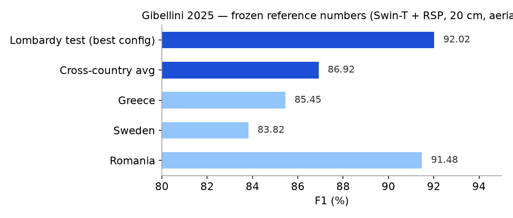
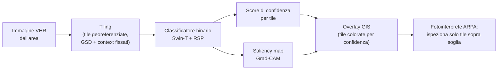

# Baseline Gibellini 2025, documento congelato

Questo doc fissa i numeri della baseline contro cui si confronta ogni esperimento della tesi.
Va inteso "inciso su pietra" (call Thomas 2026-07-17): non si aggiorna, si cita.
Fonte primaria: il preprint in `papers/library/gibellini-2025-pipeline.pdf` (26 pp). Verificato pagina per pagina il 2026-07-21.

## Riferimento

Gibellini F., Fraternali P., Boracchi G., Morandini L., Martinoli T., Diecidue A., Malegori S.,
*A Deep Learning Pipeline for Solid Waste Detection in Remote Sensing Images*, Waste Management Bulletin, 2025.
DOI 10.1016/j.wmb.2025.100246 (arXiv 2502.06607). Codice: github.com/gblfrc/waste-detection-dl-pipeline. Dataset: AerialWaste v3, Zenodo 10.5281/zenodo.12607190.

## Il paper in una frase

Binary scene classification (waste / no waste) su tile RGB da immagini VHR: in input una tile georeferenziata, in output uno score di confidenza e una saliency map Grad-CAM, visualizzati in GIS per guidare la fotointerpretazione di ARPA.

## Numeri che contano

| Cosa | Valore | Fonte (preprint) |
|---|---|---|
| Best model | Swin-T + RSP, GSD 20 cm/px, context 100 m (tile 500 px) | Sez. 4.1.4, p. 14 |
| F1 best model | 92.02% (Precision 90.02, Recall 94.13, Accuracy 94.56) | Tab. 2, p. 12 |
| Disegno sperimentale | 36 config: 2 architetture (ResNet-50, Swin-T) x 3 GSD (20/30/50 cm) x 3 context (100/150/210 m) x 2 pretraining (ImageNet, RSP su Million-AID) | Sez. 4.1, p. 12 |
| Effetto GSD | trascurabile tra 20 e 50 cm, F1 quasi piatta | Sez. 4.1.2, p. 13; Fig. 4 |
| Effetto context size | minore; penalizza ResNet-50 su context grandi, Swin-T stabile | Sez. 4.1.2, p. 13 |
| RSP vs ImageNet | miglioramento modesto ma consistente; su best config 92.02 vs 90.40 (+1.62 pp) | Sez. 4.1.3, p. 14; Tab. 2 |
| Architetture | Swin-T (27M param) batte ResNet-50 (23M) in tutte le combinazioni | Sez. 4.1.1, p. 12; Sez. 3.3.2, p. 11 |
| Training | two-step TL (backbone frozen, solo head) poi FT (ultimo stage sbloccato); batch 120; LR 0.001 (TL) e 0.0001 (FT); epoche non dichiarate | Sez. 3.3.2, p. 11 |
| Dataset | AerialWaste v3: ~11.700 tile, split 80/20, negativi:positivi 2:1; fonti AGEA ~20 cm, WorldView-3 ~30 cm, Google Earth ~21 cm nell'area target | Sez. 3.2, pp. 8-9 |
| Generalizzazione cross-country | media F1 86.92%, Accuracy 87.73% (-5.10 e -6.83 pp vs test Lombardia); Grecia 85.45, Svezia 83.82, Romania 91.48 | Tab. 3 e Sez. 4.2, p. 15 |
| Utility ARPA (soglia 0.2) | +63.2% siti trovati (155 vs 95), -60.2% area ispezionata, -12.2% tempo per sito | Tab. 4, p. 20 |
| Utility ARPA (soglia 0.7) | circa -30% tempo totale vs fotointerpretazione manuale | Sez. 4.3, p. 20 |
| Costo inferenza | 100 km2 in tempo trascurabile su una RTX 2080 Ti 12 GB | Sez. 4.3, p. 20 |

Nota: il claim "RSP batte ImageNet di ~2.3 pp" che gira negli appunti non è nel paper; sulla best config il delta è 1.62 pp (Tab. 2). Usare quello.

## La pipeline in 5 passi (Fig. 1, p. 8; Sez. 3.1, p. 7)

1. L'immagine VHR dell'area di interesse viene divisa in tile quadrate georeferenziate, con GSD e context size fissati.
2. Ogni tile passa nel classificatore binario, che restituisce uno score di confidenza per la classe waste.
3. Grad-CAM produce per ogni tile una saliency map che evidenzia i pixel su cui il modello si è concentrato.
4. Score e saliency map vengono caricati in un software GIS, sovrapposti all'immagine; le tile sono colorate per confidenza.
5. Il fotointerprete ispeziona solo le tile sopra soglia e produce la lista dei siti prioritari, da verificare poi in campo o con drone.

## La replica personale (pillar `waste/`)

Replicata la best config del paper (Swin-T + RSP su AerialWaste v3, tile 500 px a 20 cm) con PyTorch Lightning + Hydra.

- Risultato: val F1 0.9519, checkpoint `waste/checkpoints/baseline_swin_rsp_best_f1_0.9519.ckpt` (epoca 13 della fase FT).
- Two-step come nel paper: TL 10 epoche (solo head, LR 2.236e-3), FT 20 epoche (ultimo stage Swin, LR 2.236e-4, cosine). Config: `waste/configs/train.yaml`.
- Pesi RSP: `waste/checkpoints/rsp_swin_t_e300.pth`. Modello: `waste/configs/model/swin_rsp.yaml`.

Differenze rispetto al paper:

- Batch fisico 24 con gradient accumulation 5 (batch effettivo 120, come il paper); LR scalati per sqrt(5) di conseguenza (`waste/configs/train.yaml`).
- Solo immagini a 20 cm (`waste/configs/data/aerialwaste.yaml`, `target_gsd: 20`); il paper allena su tutte le fonti riscalate al GSD target.
- Le epoche (10+20) sono una scelta della replica: il paper non le dichiara.
- Il paper non specifica optimizer, weight decay e scheduler; la replica usa AdamW, wd 0.05, cosine in FT.
- Lo 0.9519 è misurato su un proxy di validazione interno (10% del train), non sul test set del paper: non è direttamente confrontabile con il 92.02. Serve come conferma che l'implementazione funziona, non come claim di miglioramento.

## Cosa significa per la tesi

- L'asticella che il prof ha in testa è F1 92.02 a 20 cm. Il confronto con il nuovo task (binary detection satellite-only, ~1.200 immagini che diventano ~2.000 con WorldView, GSD da 30 cm in su) è solo indicativo: dataset circa 10 volte più piccolo, immagini diverse, risoluzioni diverse (call 2026-07-17, `docs/01_calls/2026-07-17_pivot_binary_detection.md`). Avvicinarsi a quei numeri è l'obiettivo dichiarato, non è garantito.
- "Meglio" per la tesi non significa battere 92.02: significa caratterizzare il comportamento al degradare della risoluzione (30 cm, ~70 cm, 1.2 m) e la qualità della localizzazione, cose che il paper non fa oltre i 50 cm.
- Già fatto da Gibellini, non rivendicare come nuovo: Grad-CAM in pipeline con output su GIS; studio GSD 20-50 cm e context size; confronto pretraining RSP vs ImageNet; generalizzazione cross-country; quantificazione dell'utility per ARPA. Mazzola 2024 ha inoltre già Grad-CAM con weakly supervised localization su satellite MS.
- Spazio libero che il paper lascia: GSD sopra 50 cm, dataset satellite-only, valutazione quantitativa della localizzazione (il paper la mostra solo qualitativamente nelle figure), metodi oltre il vanilla Grad-CAM.
