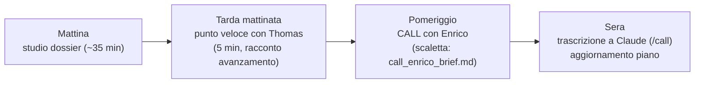
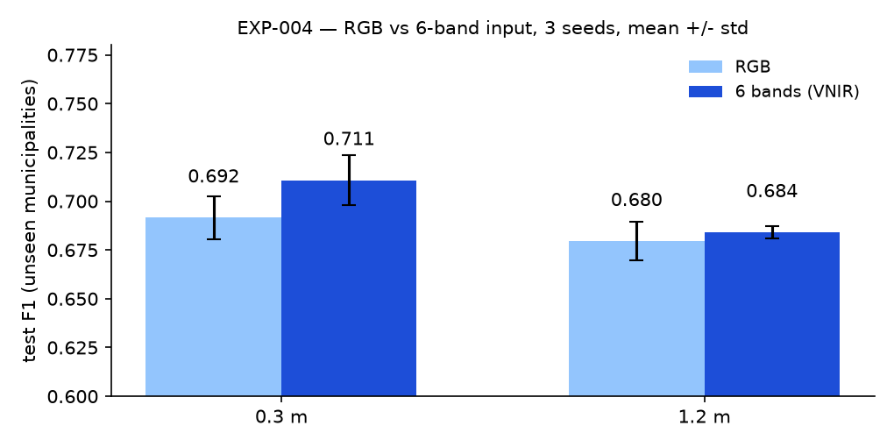

# Dossier per venerdì 24/7 (call spostata da giovedì) — tutto quello che serve, in un doc solo

> Da studiare domattina (~35 min). Ordine: leggi i diagrammi, poi le tabelle, poi il Q&A.
> La scaletta operativa della call è in `call_enrico_brief.md` (stampala o tienila aperta).

## 1. La giornata

## 2. La tesi in 60 secondi (l'elevator pitch)

Individuare discariche abusive da immagini satellitari ad altissima risoluzione, con due domande:
1. **Quanto regge la detection quando la risoluzione scende** da 0.3 m a 1.2 m? (rilevante per ARPA e per la costellazione IRIDE, che lavora attorno al metro)
2. **Si può localizzare il rifiuto dentro la tile usando solo label sì/no**, e misurare quanto la localizzazione degrada con la risoluzione? (questo è il contributo da +2 punti: to our knowledge, nessuno l'ha misurato)

Base = replica del protocollo Gibellini sul dataset satellite-only del gruppo. Innovazione = valutazione quantitativa della localizzazione weakly-supervised lungo l'asse risoluzione, con metodo oltre la vanilla Grad-CAM.

## 3. I numeri da sapere a memoria

| Cosa | Numero | Fonte |
|---|---|---|
| Gibellini best (aereo, 20 cm) | **F1 92.02** | Tab. 2 del paper |
| Gibellini cross-country | F1 86.92 medio | Tab. 3 |
| Dataset satellite-only | **1.775 img** (1.294 PNEO + 481 WV3) | aw36 sat_only |
| Positive con bbox | **286 img, 2.827 bbox, 15 categorie** | idem |
| Split Thomas (per risoluzione) | train 1.020 / val 135 / test 139 | SatRaw/PNEO/Thomas |
| Nostra baseline RGB (3 seed, EXP-003) | val **0.780±0.015** @0.3m / 0.732±0.008 @1.2m; **test 0.692±0.011 / 0.680±0.010** | EXPERIMENTS_LOG |
| 6 bande (EXP-004) | *v. sezione 7 (girate stanotte)* | idem |
| Timeline | sprint 10–23/8 → checkpoint +2 ~metà set → deposito 23/10–12/11 → **laurea 16/12** | STATO |

Attenzione al confronto trappola: il nostro 0.68-0.69 di test **non è paragonabile** al 92 di Gibellini — dataset ~10 volte più piccolo, satellite vs aereo, test su comuni mai visti, protocollo leggero. Se qualcuno lo accosta, dillo subito tu.

## 4. Cosa dire a Thomas (tarda mattinata, 5 minuti)

1. Server a posto da entrambi i PC, ambiente e GPU testati.
2. Ricognizione dati fatta: trovati gli split 0.3/1.2, le bbox, il suo README con bande e normalizzazione (usati).
3. Primi training girati (protocollo Gibellini, slot prenotati sul foglio): pipeline funziona, numeri preliminari con più seed.
4. Per la call col gruppo ho le domande pronte, soprattutto su bbox e consolidamento strip.
5. (Se lo chiede) prossimi passi: livello 0.7m, protocollo localizzazione, GitLab da Enrico.

## 5. La call con Enrico — le 5 domande che contano davvero e perché

La scaletta completa è in `call_enrico_brief.md`. Le 5 vitali, con cosa cambia in base alla risposta:

| # | Domanda | Se SÌ | Se NO |
|---|---|---|---|
| 1 | Le 2.827 bbox sono affidabili/complete? Usabili come test-set di localizzazione? | Angolo C confermato: si parte col protocollo WSOL | Piano B: annotare ~100 tile in proprio, o fallback su eval di vanilla CAM |
| 2 | Gli split Thomas 0.3/1.2 sono ufficiali? Avete già numeri su di essi? | I nostri numeri sono confrontabili coi loro | Chiedere gli split giusti e rilanciare (poco costo, script pronti) |
| 3 | Le strip in /scratch si possono consolidare in /data? | Copertura test al sicuro | Rischio: /scratch cancellabile → test set azzoppato |
| 4 | Input size / context: come gestite tile grandi a 0.3m? (il nostro 224 fisso comprime il GSD effettivo) | Adottiamo il loro protocollo | Proposta nostra: factorial GSD × input size come Gibellini |
| 5 | Repo GitLab + dove salvare risultati su /data? | Si lavora nel flusso del gruppo | Continuare in ~/experiments (temporaneo) |

Regola d'oro in call: **prima ascoltare come lavorano loro, poi proporre**. I nostri script sono usa-e-getta finché non vediamo il codice del gruppo.

## 6. Se ti chiedono X → rispondi Y

- **"Che task è?"** → Binary classification a livello di tile (waste sì/no), con localizzazione weakly-supervised come asse di studio: da label image-level a mappe/box, valutate con metriche quantitative. Non è object detection supervisionata: le bbox servono solo per VALUTARE.
- **"Perché 1.2 m se hai lo 0.3?"** → Perché la domanda operativa è cosa si perde al degradare della risoluzione: IRIDE e i sensori accessibili stanno intorno al metro; il pansharpened a 0.3 esiste solo per parte delle strip.
- **"Non l'ha già fatto Mazzola?"** → Mazzola fa IoU su asbestos e confronta 0.3-vs-1.2 pansharpened-vs-nativo (2 punti, confusi dal pansharpening). Noi: task waste, protocollo WSOL standard (MaxBoxAcc, pointing game), degradazione controllata multi-punto, metodo oltre vanilla CAM. I 4 delta sono scritti nel mini-SOTA.
- **"E il multispettrale?"** → Le 6 bande PNEO ci sono e le stiamo già usando (weight inflation sul patch embedding); primi numeri RGB vs 6 bande stanotte. È l'angolo B del piano, riciclato dentro la nuova task.
- **"SWIR?"** → Fuori scope: non è nelle acquisizioni disponibili, e il limite di Sentinel-2 è la risoluzione (10 m), non le bande. (Trappola classica: banda vs risoluzione.)
- **"Perché non un foundation model?"** → A 0.3 m non ci sono FM pretrained sensati (10-30 m di pretraining); a 1.2 m tornano discutibili e infatti sono nel piano come bonus, inclusi gli eventuali pesi in-house del gruppo.
- **"Quanto è grande il modello?"** → Swin-T, ~27M parametri, pesi RSP (Million-AID) come Gibellini.
- **"La consistency tra risoluzioni non esiste già?"** (se esce parlando di metodo) → Sì, l'equivarianza di scala esiste (SEAM CVPR 2020, SSENet; in RS una rete siamese del 2025): il nostro delta non è il vincolo in sé ma **l'asse GSD reale** — 0.3 e 1.2 m da acquisizione vera, non resize sintetico — e la misura di robustezza della localizzazione lungo quel degrado. Detto onestamente: il claim forte resta il protocollo + tetto geometrico + alta risoluzione, la consistency è un ingrediente.

## 7. Numeri finali della notte (EXP-003 + EXP-004, 3 seed ciascuno)

| Input | test F1 @0.3m | test F1 @1.2m |
|---|---|---|
| RGB | 0.692 ± 0.011 | 0.680 ± 0.010 |
| **6 bande VNIR** | **0.711 ± 0.013** | 0.684 ± 0.003 |

Le tre frasi da portare in call (calibrate, senza strafare):

1. "Sul test a comuni nuovi, **la risoluzione da sola sposta poco** (0.69 vs 0.68 tra 0.3m e 1.2m, dentro il rumore su 3 seed); in-domain invece lo 0.3m vale quasi 5 punti."
2. "Le **6 bande guadagnano circa 2 punti di test a 0.3m** rispetto a RGB, a parità di tutto: primo indizio che il multispettrale aiuta la generalizzazione. Da confermare con più seed."
3. "Sono run leggere con protocollo Gibellini e input 224 fisso: prima di trarre conclusioni vorrei allinearmi al vostro protocollo (input size, context)."

E la domanda che ne nasce per Enrico: come gestite voi l'input multispettrale (inflation? late fusion? solo RGB?) e l'input size sulle tile 0.3m?

### Aggiunta del mattino — EXP-005, il pezzo forte

Stamattina ho misurato per la prima volta la localizzazione della vanilla Grad-CAM sulle 50 immagini di test con bbox: **pointing game 6-12% contro un caso del 2%, IoU ~0.05-0.08**. Verificato che non è un bug (coordinate controllate, overlay visivi corretti): le mappe sono diffuse, il modello guarda il contesto.

La frase per la call: "Ho fatto la prima valutazione quantitativa della Grad-CAM sul satellite-only usando le vostre bbox: è vicina al caso. È la misura che in letteratura nessuno riporta, e giustifica il pezzo di metodo della tesi: localizzazione oltre la vanilla CAM, valutata lungo l'asse di risoluzione."

Aggiornamento di giovedì sera (EXP-006): provata tutta la scala delle CAM "gratis" — la migliore è Grad-CAM dallo stage 14×14, che raddoppia la IoU (fino a 0.14 con le 6 bande) ma resta bassa; LayerCAM non aiuta.

**E il perché è dimostrato (EXP-008, il numero più bello da raccontare)**: gli oggetti annotati hanno lato mediano **27 px ≈ 8 metri** — il 99% è più piccolo di una cella della griglia 7×7. Ho costruito l'oracolo: una CAM **perfetta** a 7×7 farebbe pointing game 0.06 — esattamente il nostro numero reale. Non è un difetto di training: è un tetto geometrico. I tetti: 14×14 → 0.46, **28×28 → 0.86**.

La frase per la call: "Ho quantificato anche il tetto teorico: a 7×7 nemmeno una CAM perfetta localizzerebbe questi oggetti (mediana 8 metri). Il requisito del metodo esce dai dati: mappe ad alta risoluzione, almeno 28×28. E ne nasce una domanda per voi: le bbox annotano oggetti — per la valutazione ha senso anche una nozione di sito aggregato?"

### I risultati della notte di giovedì (il cerchio completo)

1. **Il tetto si sfonda (EXP-009)**: alzando solo la risoluzione della mappa (input 448→28×28, 672→42×42), il pointing game **triplica**: 0.12 → 0.36 → 0.38 (6 bande, 0.3m). La previsione dell'oracolo è confermata sperimentalmente. Prezzo: la detection cala (modello allenato a 224) → in corso il **retrain a 448** (risultati venerdì all'alba).
2. **La consistency funziona dove deve (EXP-007b)**: sulla detection è neutra (+0.7pp, rumore), ma sulla localizzazione **a 1.2m** — il bersaglio del metodo — il pointing game sale da 0.100 a 0.153, con tutti e 3 i seed sopra il controllo. Primo segnale che il vincolo cross-GSD rende la localizzazione più robusta al degrado.

La frase-sintesi per la call: "In una settimana: misurato che la CAM vanilla è al tetto geometrico (oggetti da 8 metri vs celle da 30), verificato sperimentalmente che alzando la risoluzione della mappa la localizzazione triplica, e visto il primo segnale che il vincolo di coerenza tra 0.3 e 1.2 metri la rende più robusta al degrado. Il metodo della tesi nasce da qui: mappe ad alta risoluzione + consistency sull'asse GSD reale + eventuale refinement con SAM."

## 8. Glossario minimo (una riga l'uno)

- **GSD**: dimensione al suolo di un pixel (0.3 m = un pixel copre 30 cm).
- **Pansharpening**: fusione della banda pancromatica ad alta risoluzione con le bande colore a bassa: dà i "0.3 m" multispettrali.
- **WSOL**: localizzare oggetti avendo in training solo label a livello di immagine.
- **CAM / Grad-CAM**: mappa di calore di dove il classificatore "guarda"; base del WSOL.
- **MaxBoxAcc / pointing game**: metriche WSOL: la box derivata dalla CAM coincide col GT? il picco della CAM cade nel GT?
- **TL / FT**: le due fasi del protocollo Gibellini (prima solo testa, poi ultimo stage sbloccato).
- **Weight inflation**: adattare i kernel RGB pretrained a input con più bande, copiandoli e riscalandoli.
- **RSP**: pretraining su Million-AID (immagini aeree), alternativa a ImageNet.

## 9. Registro (ripasso di 20 secondi)

- Mai "OOD" → di' "generalizzazione" / "comuni non visti".
- Mai "rilevare rifiuti" per ARPA → "individuare siti e classificarli per rischio, per intervento efficiente".
- I nostri numeri = "primi run di sanity/baseline", mai "risultati".
- Flusso lineare: non tornare indietro su argomenti già chiusi.
- Per ogni lavoro citato sappi rispondere "che task è" (classification / detection / segmentation).

## 10. Per approfondire (se hai più tempo)

1. `docs/02_research/2026-07-21_eda_dati_eagle.md` — i dati veri sul server (10 min)
2. `docs/02_research/baseline_gibellini_frozen.md` — la baseline congelata (15 min)
3. `docs/02_research/wsol_mini_sota.md` — il verdetto novelty coi 4 delta (10 min)
4. `docs/04_planning/indice_tesi_v0.md` — la struttura della tesi (5 min)
