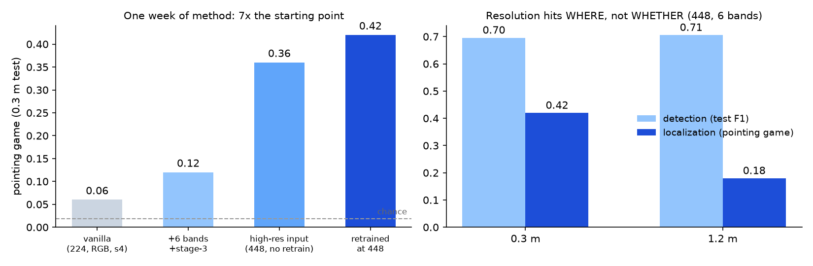
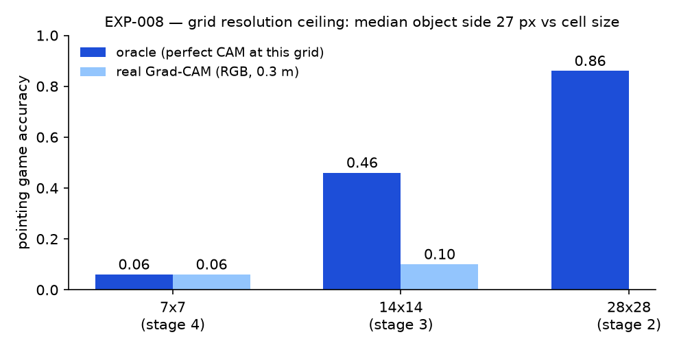
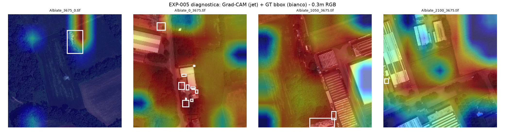
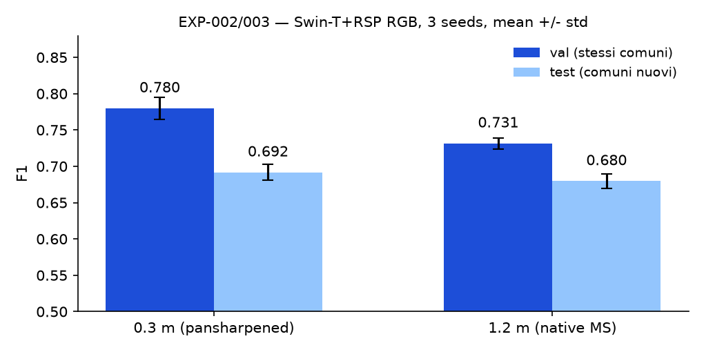
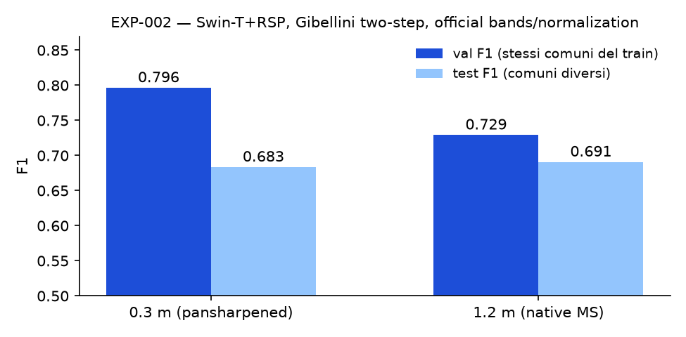
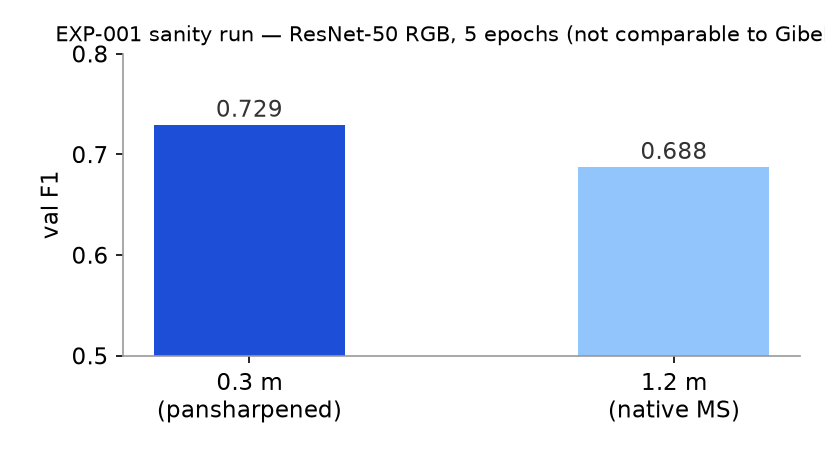

# EXPERIMENTS_LOG — registro esperimenti

> Un esperimento = una entry, appesa in cima alla sezione **Log** (ordine cronologico inverso). Ogni entry che supporta/uccide un claim aggiorna anche `CLAIMS.md`. Niente numeri senza fonte riproducibile (path del run su eagle o del notebook).
>
> **Naming (dalla call 24/7 — Thomas: nomi descrittivi, mai "esperimento 1,2,3"):** id = `bGSD_bande_arch_pretrain_aug_sSEED`, es. `b120_vnir_swint_rsp_aug1_s42` — le stesse dimensioni delle colonne dell'Excel "Binary Experiments Results" su Drive, che va compilato a ogni run. Le entry EXP-001…010 (21-24/7) restano come fase esplorativa pre-allineamento; dal 24/7 si usa il nuovo schema, con numerazione progressiva mantenuta nel titolo per l'ordine (es. "EXP-011 `b120_rgb_swint_rsp_aug1_s42`").

## Template

```markdown
### EXP-NNN — <titolo breve> (YYYY-MM-DD)
- **Domanda**: cosa volevo sapere
- **Setup**: modello / pesi / dati (+ split, seed) / risoluzione / config (path Hydra o comando)
- **Dove**: path risultati su eagle (/data/... ) o notebook
- **Risultati**: metriche chiave (tabella se >2 numeri)
- **Conclusione** (1 riga, tag: HIGH/MEDIUM/UNCERTAIN)
- **Claims toccati**: C-N ↑/↓ (vedi CLAIMS.md)
- **Next**: cosa apre/chiude
```

## Coda esperimenti pianificati (dal piano 7 punti — da rivedere post-call Enrico)

| Priorità | Esperimento | Fase | Dipendenze |
|---|---|---|---|
| 1 | Sanity run: riproduzione baseline gruppo su satellite-only ~1.2k (modello indicato da Enrico) | Base | accesso eagle + GitLab |
| 2 | Baseline a 30 cm: numeri di riferimento propri (F1/P/R, seed ≥3 se budget lo consente) | Base | EXP precedente |
| 3 | Griglia risoluzioni: 30 → ~70 → 120 cm (stesso modello, stesso split) | Base | 2 |
| 4 | +WorldView (~2k img): impatto dimensione dataset | Base | disponibilità immagini |
| 5 | CAM sulla baseline: estrazione mappe + prima eval qualitativa strutturata | Semina C | 2 |
| 6 | Eval quantitativa localizzazione su test-set poligoni (se/quando esiste) | Innovazione | gating question |
| 7 | Method v1: CAM → pseudo-mask → refinement | Innovazione | 6 |
| 8 | Consistency cross-GSD sulla localizzazione | Innovazione | 3 + 6 |
| 9 | FM comparison (DOFA / Scale-MAE / pesi in-house se arrivano) a 1.2 m | Bonus | 3 |

## Log

### EXP-011 `b120_rgb_resnet50_rsp_aug1_s0` — prima run nella pipeline del gruppo (2026-07-24, sera)
- **Domanda**: la pipeline di Enrico gira end-to-end con la config di default del command creator a 120 cm? Che baseline dà?
- **Setup**: pipeline gruppo (`multispectralpotenza`, branch `ale`), ResNet50 + RSP, RGB, patch 8-bit 176px native (`patches_MS_8bit_120cm`), split Thomas 1020/135/139, Aug fliph/flipv/rot90 (brightness OFF come da notebook), TL (head, lr 1e-3, early stop → 26 ep) → FT (full, lr 1e-4 → 17 ep), Adam, batch 50, seed 0. Runner: `network/commands/b120_rgb_resnet50_rsp_aug1_s0.sh`.
- **Dove**: eagle `/data/waste/multilabel/SatRaw/Mosaico_PNEO_2_3_9/b120_rgb_resnet50_rsp_aug1_s0/{tl,ft}` + log `~/experiments/b120_rgb_resnet50_rsp_aug1_s0.log`.
- **Risultati** (test 139 img / 55 pos, comuni mai visti): **F1 0.635** @0.5 · Acc 0.669 · P 0.563 · R 0.727 · AUROC 0.770 · best-threshold su test 0.26 → F1 0.645. Val FT ~0.73.
- **Conclusione**: pipeline validata end-to-end (con 4 fix minimi committati sulla branch); la baseline resnet50-RSP-RGB del gruppo a 120 cm sta ~4.5 pp sotto la nostra Swin-T-RSP-RGB equivalente (0.680, EXP-003, ma su 16-bit + norm ufficiale: confronto indicativo, non controllato). [HIGH sul funzionamento; MEDIUM sul confronto cross-pipeline]
- **Claims toccati**: nessuno direttamente; abilita il porting di C1-C3 nella pipeline ufficiale.
- **Next**: `b120_rgb_swint_rsp` (loro SwinT RGB) e poi SwinT multibanda (nostra inflation) per il confronto pulito dentro la stessa pipeline; chiarire con Enrico threshold su val vs test per la colonna Best Thresholds.

### EXP-010 — Retrain a 448: localizzazione ×7 con detection intatta; la risoluzione colpisce il "dove" (2026-07-24, notte)
- **Domanda**: riallenando a input 448 (griglia s3 28×28) si tengono insieme detection e localizzazione? E cosa fa l'asse risoluzione sulla localizzazione?
- **Setup**: `baseline_swin_rsp_pneo.py --tile-px 448 --bands all6 --batch 48`, protocollo solito, seed 42, 0.3m e 1.2m. Eval WSOL con gradcam_s3 (28×28) a input 448 (`exp010_wsol.log`).
- **Risultati (test)**:

| | 0.3m | 1.2m |
|---|---|---|
| Detection F1 | 0.696 | **0.706** |
| Pointing game | **0.420** | 0.180 |
| MaxBoxAcc@0.5 | 0.120 | 0.060 |
| mean best IoU | **0.311** | 0.176 |



- **Conclusione**: (1) il trade-off di EXP-009 si risolve col retrain: pg 0.42 CON detection 0.70 — dal punto di partenza (0.06) è **×7 in una settimana**, IoU 0.049→0.311. (2) **Il risultato di tesi**: da 0.3m a 1.2m la detection non si muove (0.696→0.706) ma la localizzazione si dimezza (pg 0.42→0.18, IoU 0.31→0.18) — la degradazione di risoluzione colpisce il "dove", non il "se". È il fenomeno che nessuno ha misurato e che motiva l'intero angolo C. Tag: MEDIUM (1 seed; da confermare multi-seed).
- **Claims toccati**: C2 avviato con numeri; nasce il claim candidato "resolution degrades localization before detection" (da verificare con seed e col livello 0.7m).
- **Next**: multi-seed 448; consistency a 448; livello 0.7m per la curva completa; SAM refinement sui picchi.

### EXP-009 — Il tetto si sfonda: input ad alta risoluzione (2026-07-24, notte)
- **Domanda**: la previsione di EXP-008 regge? Con mappe più fitte (input 448→stage-3 28×28; 672→42×42) la localizzazione sale?
- **Setup**: inference-only sui checkpoint allenati a 224 (finestre Swin invariate, cambia la griglia; buffer dipendenti dalla griglia rigenerati). Script `exp009_highres_input.py`.
- **Risultati chiave (0.3m, 6 bande, gradcam_s3)**:

| Input | griglia s3 | pointing game | mean IoU | test F1 detection |
|---|---|---|---|---|
| 224 | 14×14 | 0.12 | 0.143 | 0.705 |
| 448 | 28×28 | **0.36** | 0.198 | 0.600 |
| 672 | 42×42 | **0.38** | **0.240** | 0.432 |

- **Conclusione**: **la previsione del tetto è confermata sperimentalmente** — pointing game triplicato alzando la sola risoluzione della mappa. Il prezzo è la detection (il classificatore è fuori distribuzione rispetto al training a 224; a 672 crolla). → La strada è **riallenare a 448**: EXP-010 lanciato nella stessa notte (0.3m e 1.2m, 6 bande). Tag: MEDIUM (1 seed).
- **Claims toccati**: C2: requisito alta risoluzione verificato; il trade-off localizzazione/detection diventa parte della storia.

### EXP-007 — Consistency cross-risoluzione, parte detection (2026-07-23, notte)
- **Domanda**: allenare con le stesse tile a 0.3m e 1.2m e un vincolo di coerenza tra le CAM (λ=1) cambia la detection rispetto allo stesso training senza vincolo (λ=0)?
- **Setup**: un solo Swin-T+RSP che vede entrambe le versioni di ogni tile; loss = BCE(0.3)+BCE(1.2)+λ·L2 tra CAM lineari normalizzate (solo positive); two-step come al solito; λ∈{0,1}, seed 42/43/44. Script `exp007_consistency.py` (mirror in `eagle/`). Nota prior art (ricerca 23/7): l'equivarianza di scala esiste (SEAM 2020) — qui l'asse è il GSD reale.
- **Risultati detection (test, media±std 3 seed)**:

| Training | test F1 @0.3m | test F1 @1.2m |
|---|---|---|
| dual-res λ=0 (controllo) | 0.690 ± 0.011 | 0.676 ± 0.008 |
| dual-res λ=1 (consistency) | 0.697 ± 0.022 | 0.682 ± 0.009 |
| (rif.: single-res, EXP-003) | 0.692 ± 0.011 | 0.680 ± 0.010 |

- **Conclusione (parte 1)**: sulla detection la consistency dà +0.6/0.7 pp, dentro il rumore; il dual-res training da solo non cambia nulla. Atteso dopo EXP-008 (a 7×7 il vincolo lavora sotto il tetto geometrico).
- **Parte b — localizzazione (gradcam_s3, test)**: a 0.3m nessuna differenza (pg medio 0.113 per entrambi); **a 1.2m — la risoluzione degradata, il bersaglio del metodo — pg medio 0.100 (λ=0) → 0.153 (λ=1), con tutti e 3 i seed λ=1 sopra il rispettivo controllo**. IoU drop 0.3→1.2 leggermente ridotto (0.032→0.027). Numeri piccoli ma direzione pulita: il vincolo aiuta dove deve. Tag: MEDIUM (effetto piccolo, n=50).
- **Next**: combinare le due leve — retrain a 448 (EXP-010, in corso) e poi consistency a 448/stage-3, dove il vincolo ha spazio per lavorare (v. `metodo_prossimi_passi.md`).

### EXP-008 — Il tetto teorico: gli oggetti sono più piccoli della griglia CAM (2026-07-23, sera)
- **Domanda**: il fallimento della CAM vanilla è un problema di training o strutturale? Qual è il massimo raggiungibile a ogni risoluzione di mappa?
- **Setup**: analisi CPU-only. (1) statistiche delle GT bbox (351 test + 2827 totali); (2) "oracolo": CAM perfetta = maschera GT ridotta alla griglia (7×7/14×14/28×28), poi stessa pipeline metrica di EXP-005. Script `exp008_bbox_analysis.py`.
- **Risultati**:

| Fatto | Valore |
|---|---|
| Lato mediano oggetto @0.3m | **27 px ≈ 8 m** (area mediana ~70 m²; mediana 5-8 box/img) |
| Box più piccole di 1 cella 7×7 (100 px) | **99%** (test) / 97% (tutte) |
| Box più piccole di 1 cella 14×14 (50 px) | 91% / 83% |
| Oracolo 7×7 | pointing game **0.060**, IoU max 0.232 |
| Oracolo 14×14 | pointing game 0.460, IoU 0.454 |
| Oracolo 28×28 | pointing game **0.860**, IoU 0.611 |



- **Conclusione**: il nostro Grad-CAM reale a 7×7 (PG 0.06) **satura esattamente il tetto teorico della sua griglia** — il fallimento è strutturale, non di training. Le annotazioni sono a livello di OGGETTO (~8 m), non di sito: a 1.2 m un oggetto mediano è ~7 px. **Requisito di metodo derivato dai dati: mappe di localizzazione ad alta risoluzione (≥28×28)**, non varianti CAM. A stage-3 il reale (0.10) è ancora sotto il tetto (0.46) → lì c'è anche margine di training. Tag: HIGH (analisi deterministica).
- **Claims toccati**: fonda il requisito del metodo C2 e la lettura di EXP-005/006; apre la distinzione oggetto-vs-sito per la valutazione (aggregare le box in siti?).
- **Next**: (a) in call: le bbox annotano oggetti — esiste/serve una nozione di "sito" aggregato per la valutazione? (b) metodo con output ad alta risoluzione (decoder leggero / pseudo-mask a 28×28+); (c) EXP-007 in corso letto con questa lente (a 7×7 la consistency non può alzare i numeri assoluti).

### EXP-006 — Scala delle varianti CAM: il meglio "gratis" resta debole (2026-07-23, sera)
- **Domanda**: quanto si recupera cambiando variante CAM (stage intermedi, LayerCAM) senza toccare il training?
- **Setup**: come EXP-005 (50 img test con bbox, ckpt seed 42, 4 config) × 4 varianti: gradcam_s4 (7×7), gradcam_s3 (14×14), layercam_s3, layercam_s2 (28×28). Script `exp006_cam_ladder.py`.
- **Risultati** (metrica principale mean best IoU; pg = pointing game):

| Config | gradcam_s4 | **gradcam_s3** | layercam_s3 | layercam_s2 |
|---|---|---|---|---|
| 0.3m RGB | 0.049 (pg .06) | **0.106 (pg .10)** | 0.065 | 0.060 |
| 0.3m 6 bande | 0.078 (pg .12) | **0.143 (pg .12)** | 0.088 | 0.061 |
| 1.2m RGB | 0.056 (pg .10) | **0.095 (pg .14)** | 0.074 | 0.057 |
| 1.2m 6 bande | 0.072 (pg .06) | **0.084 (pg .08)** | 0.037 | 0.041 |

- **Conclusione**: gradcam_s3 (14×14) è la variante migliore ovunque e **raddoppia la IoU**, ma il livello assoluto resta basso (max 0.14); LayerCAM non aiuta su questo task. L'intera famiglia CAM vanilla è debole: il classificatore usa il contesto. Rafforza sia il valore del protocollo di misura (C1) sia la necessità di un metodo training-time (C2 = EXP-007). La combinazione 6 bande + s3 a 0.3m è la migliore in assoluto (0.143). Tag: MEDIUM (1 seed).
- **Claims toccati**: C1 (protocollo) rafforzato; motivazione quantitativa per C2.
- **Next**: EXP-007 stanotte (consistency); poi valutare pseudo-mask refinement e attention maps di Swin.

### EXP-005 — Prima misura WSOL: vanilla Grad-CAM vicina al caso (2026-07-23, mattina)
- **Domanda**: quanto localizza davvero la vanilla Grad-CAM sul nostro task? (la misura che nessuno riporta: Gibellini/AerialWaste mostrano CAM solo in figura)
- **Setup**: Grad-CAM sull'ultimo stage Swin (7×7 → upsample nello spazio annotazioni), checkpoint seed 42 delle 4 config; 50 immagini positive di test con 351 GT bbox; metriche: pointing game, MaxBoxAcc@0.5 (protocollo Choe), mean best IoU. Script `exp005_wsol_eval.py` (mirror in `eagle/`).
- **Risultati**:

| Config | pointing game | MaxBoxAcc@0.5 | mean best IoU |
|---|---|---|---|
| 0.3m RGB | 0.060 | 0.020 | 0.049 |
| 0.3m 6 bande | 0.120 | 0.020 | 0.078 |
| 1.2m RGB | 0.100 | 0.000 | 0.056 |
| 1.2m 6 bande | 0.060 | 0.000 | 0.072 |

Baseline del caso (area GT / area immagine): pointing game ≈ 0.019. Verifica anti-bug: swap x/y peggiora (0.02), overlay visivi corretti.



- **Conclusione**: la vanilla Grad-CAM da stage-4 (7×7) è poco sopra il caso: mappe diffuse, il classificatore usa il contesto. È la **prima quantificazione** di ciò che in letteratura si mostra solo qualitativamente, e **motiva il contributo**: serve un metodo di localizzazione oltre la vanilla CAM (stage precedenti a risoluzione più alta, LayerCAM, pseudo-mask refinement, consistency cross-GSD). Nota: le 6 bande raddoppiano il pointing game a 0.3m (0.12 vs 0.06) — segnale debole ma coerente con EXP-004. Tag: MEDIUM (1 seed, 50 img).
- **Claims toccati**: fonda C ("valutazione quantitativa mai fatta") e la necessità del metodo (delta 4 del mini-SOTA).
- **Next**: (a) CAM da stage-3 (14×14) e LayerCAM — probabile grande salto; (b) più seed; (c) proporre il protocollo in call.

### EXP-004 — 6 bande VNIR vs RGB (2026-07-23, notte)
- **Domanda**: le 6 bande PNEO (DB,B,G,R,RE,NIR) aggiungono qualcosa rispetto a RGB, a parità di tutto il resto?
- **Setup**: come EXP-003 ma input a 6 canali: weight inflation del patch embedding (kernel RGB nelle posizioni R,G,B dell'ordine bande, media dei kernel nelle bande extra, riscala 3/6), normalizzazione ufficiale a 6 bande. Seed 42/43/44 × {0.3m, 1.2m}. Slot notturno 0-8 GPU 1.
- **Dove**: `eagle:~/experiments/baseline_{res}_all6_seed{42,43,44}.log` + script `baseline_swin_rsp_pneo.py --bands all6` (mirror in `eagle/`).
- **Risultati** (test = comuni nuovi; media ± std, 3 seed):

| Input | test F1 @0.3m | test F1 @1.2m | val F1 @0.3m | val F1 @1.2m |
|---|---|---|---|---|
| RGB | 0.692 ± 0.011 | 0.680 ± 0.010 | 0.780 ± 0.015 | 0.732 ± 0.008 |
| 6 bande | **0.711 ± 0.013** | 0.684 ± 0.003 | 0.769 ± 0.008 | 0.685 ± 0.020 |


- **Conclusione**: a 0.3m le 6 bande guadagnano **+1.9 pp di test F1** (tutti e tre i seed sopra 0.70) pur con val leggermente inferiore → primo indizio che il multispettrale aiuta la **generalizzazione ai comuni nuovi** più che il fit in-domain. A 1.2m nessun effetto sul test e val peggiore (inflation forse subottimale a bassa risoluzione). Con 3 seed e 139 img di test è un segnale, non un claim. Tag: MEDIUM.
- **Claims toccati**: semina B (risoluzione×spettro) — "MS aiuta la generalizzazione" è un'ipotesi ora testabile seriamente.
- **Next**: (a) chiedere in call come il gruppo gestisce l'input MS; (b) più seed + livello 0.7m per la griglia completa; (c) provare late fusion in alternativa all'inflation.

### EXP-003 — Multi-seed della baseline RGB (2026-07-23, notte)
- **Domanda**: il gap 0.3m vs 1.2m di EXP-002 sopravvive alla varianza dei seed?
- **Setup**: identico a EXP-002, seed 42/43/44 (42 = EXP-002 stesso run). Slot notturni prenotati (mer 22-24, gio 0-8, GPU 1).
- **Dove**: `eagle:~/experiments/baseline_{res}_seed{43,44}.log`
- **Risultati** (media ± std su 3 seed):

| Risoluzione | val F1 | test F1 (comuni nuovi) |
|---|---|---|
| 0.3m | **0.780 ± 0.015** | 0.692 ± 0.011 |
| 1.2m | 0.732 ± 0.008 | 0.680 ± 0.010 |



- **Conclusione**: in-domain lo 0.3m vale ~+4.8 pp (oltre il rumore); sui comuni nuovi il gap scende a ~1.2 pp, dentro ~1 std → a queste dimensioni di test (139 img) la risoluzione non mostra un vantaggio robusto in generalizzazione. Coerente con l'effetto-GSD debole di Gibellini, ora con barre d'errore. Resta il caveat input-size 224 di EXP-002. Tag: MEDIUM.
- **Claims toccati**: semina C/B (asse risoluzione): il claim "cosa si perde davvero scendendo di risoluzione" ha ora la prima base quantitativa.
- **Next**: EXP-004 (6 bande vs RGB, stessa griglia, in corso stanotte); livello 0.7m; protocollo input-size da chiarire in call.

### EXP-002 — Baseline Swin-T+RSP, protocollo Gibellini, 0.3m vs 1.2m (2026-07-22)
- **Domanda**: prima baseline "seria" sugli split di Thomas con setup corretto (bande RGB ufficiali, normalizzazione del gruppo, copertura 100% archive+scratch). Primo segnale sull'asse risoluzione con split geografico.
- **Setup**: Swin-T + RSP (pesi `rsp_swin_t_e300.pth`), two-step Gibellini: TL 10 ep (backbone frozen, LR 1e-3) → FT 20 ep (ultimo stage, LR 1e-4, cosine), batch 120, AdamW wd 0.05, seed 42, tile 224px, RGB = bande 4,3,2 (ordine DB,B,G,R,RE,NIR), normalizzazione ufficiale clip p1-p99 + standardize. Split completi: train 1020 / val 135 / test 139 (test = comuni diversi dal train). GPU 1 eagle, slot prenotato 10-12.
- **Dove**: `eagle:~/experiments/baseline_swin_rsp_pneo.py` + `baseline_03.log` / `baseline_12.log` + ckpt `baseline_swin_rsp_{res}_valf1_*.pt`. Mirror script in `eagle/` (repo).
- **Risultati**:

| Risoluzione | best val F1 | test F1 (comuni nuovi) |
|---|---|---|
| 0.3m (pansharpened) | **0.7963** | 0.6833 |
| 1.2m (MS nativo) | 0.7290 | **0.6906** |



- **Conclusione**: a 0.3m val migliore ma calo netto sui comuni nuovi (−11 pp); a 1.2m val≈test. Sul test le due risoluzioni sono **quasi pari** — coerente con l'effetto-GSD debole di Gibellini (20-50cm aereo), ma qui 1 seed e 139 img: nessuna conclusione forte. Tag: MEDIUM (setup corretto e riproducibile; numeri preliminari).
- **Caveat metodologico da risolvere**: input fisso 224px → le tile 0.3m (~670px) vengono ridimensionate, comprimendo il GSD effettivo verso ~0.9m; l'asse risoluzione va disegnato controllando context size e input size separatamente (come il factorial di Gibellini). Punto da discutere in call.
- **Claims toccati**: prepara C sull'asse risoluzione (nessun claim ancora).
- **Next**: (a) multi-seed (≥3) per stimare la varianza; (b) griglia con ~0.7m; (c) 6 bande vs RGB; (d) chiarire con Enrico input size / context nel loro protocollo.

### EXP-001 — Sanity run binario PNEO, 0.3m vs 1.2m (2026-07-21)
- **Domanda**: la pipeline dati end-to-end (split Thomas → ritaglio dai mosaici → training) funziona? Primo segnale sull'effetto risoluzione.
- **Setup**: ResNet-50 ImageNet (torchvision), 3 bande RGB dalle 6 PNEO, tile 224px, AdamW lr 1e-4 wd 0.05, batch 32, 5 epoche, no seed control. Split `SatRaw/PNEO/Thomas/{0.3m,1.2m}/binary` (train 963, val 120 dopo scarto di 57+15 tile fuori dai 5 mosaici Lombardia). Normalizzazione per-tile max (provvisoria). GPU 1 eagle, slot prenotato.
- **Dove**: `eagle:~/experiments/sanity_binary_pneo.py` + `sanity_03.log` / `sanity_12.log`
- **Risultati**:

| Risoluzione | best val F1 (5 ep) |
|---|---|
| 0.3m (pansharpened) | **0.7294** |
| 1.2m (MS nativo) | **0.6875** |



- **Conclusione**: pipeline funzionante, il modello impara (loss 0.66→0.10); primo indizio del gap di risoluzione (~4 pp F1), NON confrontabile con Gibellini 92.02 (modello, dati, epoche, protocollo diversi). Tag: UNCERTAIN (sanity, no seed, val 120 img).
- **Claims toccati**: nessuno (sanity). Prepara il terreno per C sulla griglia risoluzioni.
- **Next**: (a) chiedere a Enrico perché ~6% delle tile cade fuori dai 5 mosaici processed e quale sia la normalizzazione/ordine bande ufficiale; (b) EXP-002 = baseline vera (Swin-T+RSP, protocollo Gibellini, più epoche, seed); (c) integrare le 6 bande.
